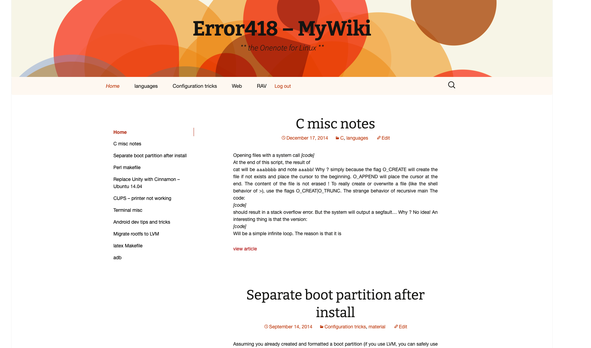
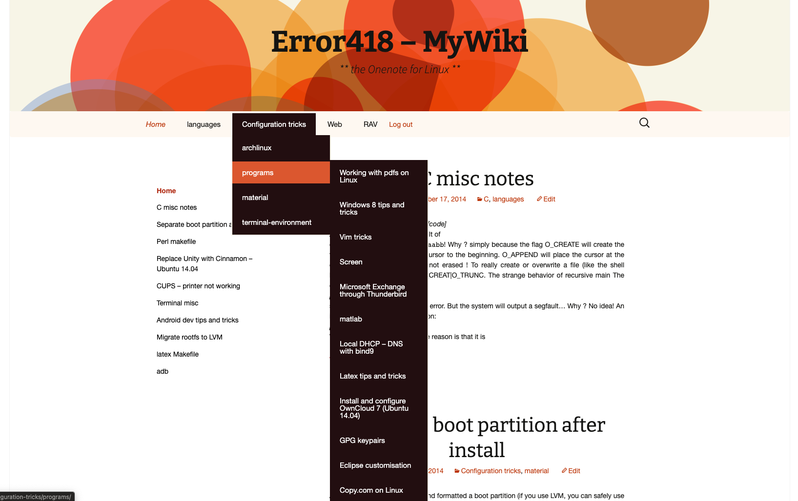
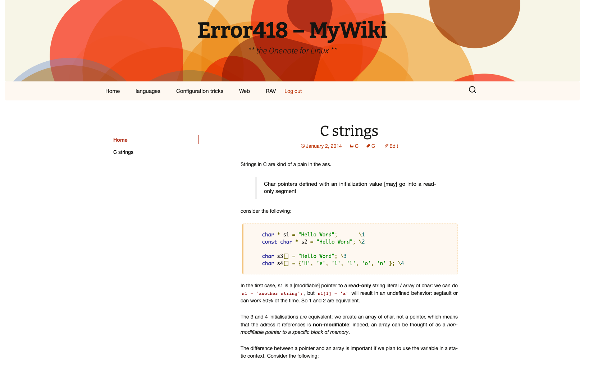
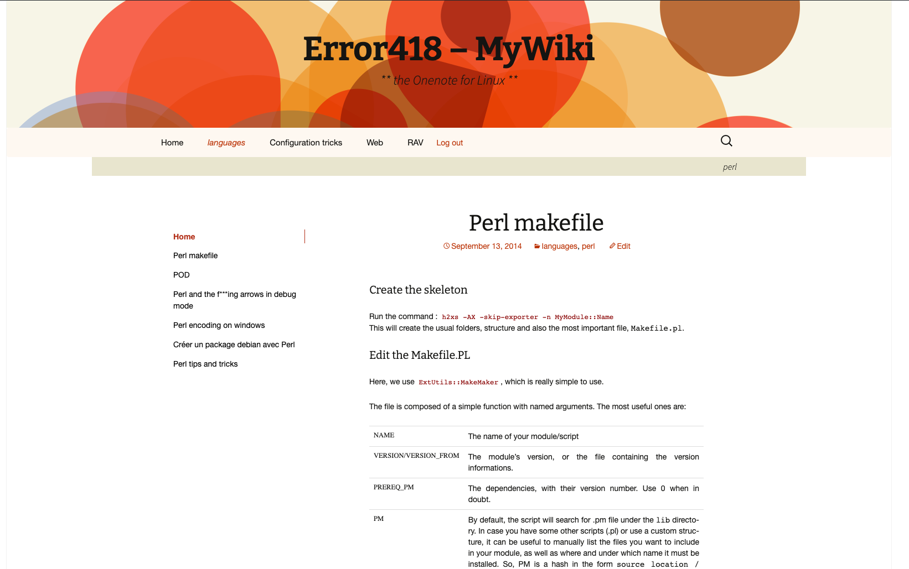
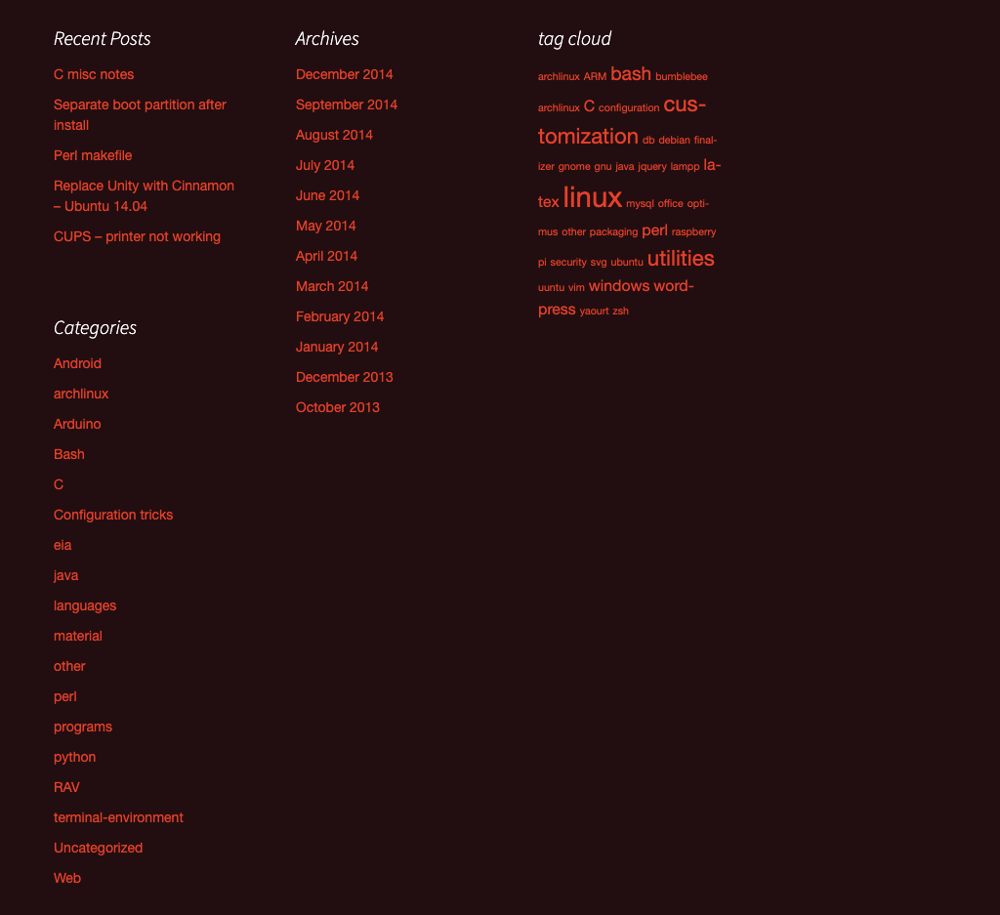

# MyWiki

This wordpress site is a remnant of a wiki tentative back in **2013 - early 2014**...
(I just discovered computers, hardly one year in).

There are are bunch of articles on perl, archlinux, latex, bumblebee (making Optimus work on Linux), etc.

**IMPORTANT**: do NOT try to update wordpress, as the code blocks will be completely messed up !!!

## How to

1. run `docker-compose up`
2. go to http://localhost
3. login using `chief`:`chief`

## Preview

