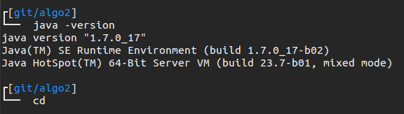

## bash prompt

A nice function to show only the two last directories on the PWD path:

```bash
_PS1() {
    # note: with split, $_[0] is empty since pwd always begin with /
    echo "$PWD" | perl -e '$_ = \<>; chomp; 
    print "/" and exit if $_ eq "/";
    s|$ENV{HOME}|~|g; @_ = split "/", $_; 
    print $_ and exit if scalar @_ \< 2;
    print "/" if $_[0] eq "" and scalar @_ == 3;
    print "$_[-2]/$_[-1]";'
}
```

You can use it directly in the PS1= in your bashrc. For example:`PS1='[\[\033[00;34m\]$(_PS1 )\[\033[00;37m\]]\[\033[00m\] '`

A really funny PS1:

```bash
PS1="\\n\\[\\033[0;37m\\]\\342\\224\\214\\[\\e]0;\\u@\\h: \\w\\a\\][\\[\\033[00;34m\\]$(_PS1 )\\[\\033[00;37m\\]]\\[\\033[00m\\] \\n\\[\\033[0;37m\\]\\342\\224\\224\\342\\224\\200\\342\\224\\200 \\[\\033[0m\\]"
```



Got those funny ideas here: [https://wiki.archlinux.org/index.php/Color\_Bash\_Prompt](https://wiki.archlinux.org/index.php/Color_Bash_Prompt)

Good to know : the - symbol is made from the following sequence : `\342\224\200`
