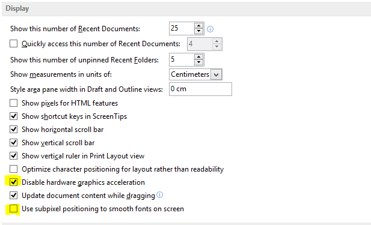

## Turn off Office animations

Office 2013 is the first release to use hardware acceleration throughout the user experience to deliver beautiful, fluid animations. But if you use your computer without a display or just prefer to block unnecessary animations, you have the choice to turn them off.

1. Open the Ease of Access Center (shown below) by pressing the Windows logo key + U.
2. Under Explore all settings, click Use the computer without a display.
3. Under Adjust time limits and flashing visuals, click Turn off all unnecessary animations (when possible).
4. Click OK.

To go even further:

1. open Microsoft Word
2. click of File > Options > Advanced
3. scroll to the display section
4. check "Disable hardware acceleration
5. uncheck "use subpixel positioning to smooth font on screen"
6. restart Microsoft Word

## Disable password on login

1. launch a terminal in admin mode
2. type `control userpassword2`
3. uncheck users must entre a username and password to use this computer
4. click apply
