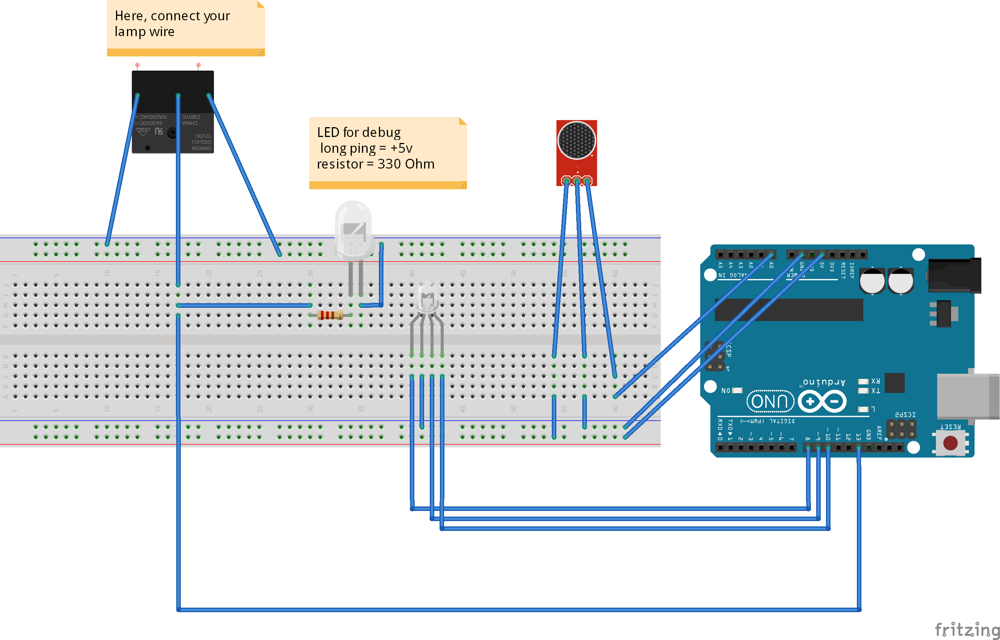

## Material

*   1 arduino uno
*   1 sound detector, like [this one](https://www.sparkfun.com/products/12642) or a cheaper one. The most important is that it provides sound amplification.
*   1 relay supporting high tension. I personally used a relay module srd-05vdc-sl-c
*   Wires

Optionally:

*   1 RGB Led
*   1 Led + 1 330 Ohm resistor

## Schema

[](../wordpress/wp-content/uploads/2014/07/arduino_clapper_schema.png)

The led is connected to the relay signal, so that it reflects the state of the light (or whatever you connected to the relay). With simple leds, always put a resistor, usually 330 Ohm. Recall that the longest pin of the Led is the +, the other is connected to the ground.

The RGB Led allows us to give feedback during the claps detection.

The relay has three pins: ground, +5v and signal. The latter is configured as INPUT and delivers an analog signal between 0 and 255. It is highly unstable: don't expect to be able to differentiate between a clap, a cry or even a laughter.

## Code

The driver for the RGB Leds can be found [here (.h)](../wordpress/wp-content/uploads/2014/07/RGBLed.h) and [here (.cpp)](../wordpress/wp-content/uploads/2014/07/RGBLed.cpp_.txt)

```python
include "RGBLed.h"

// tree_clap_test.ino

#define sensitivity 30
#define debugLed    13
#define sensor      A0
#define light       12
#define BluePin     10
#define GreenPin    9
#define RedPin      8

#define deltaMin    200
#define deltaMax    900

#define no_clap     0
#define one_clap    1
#define two_clap    2

#define debug

int lightState = LOW; /**< The light state: ON or OFF */
unsigned long lastClap = 0; /**< time of last clap, for debug */

RGBLed rgbLed = RGBLed(RedPin, GreenPin, BluePin);

void setup()
{

    pinMode(debugLed, OUTPUT);
    pinMode(light, OUTPUT);
    pinMode(sensor, INPUT);

    #ifdef debug
    Serial.begin(9600);
    Serial.println("initialisation done");
    #endif
}

void loop()
{
    // choose your method
    while(true) three_claps();
}

/**
 * @brief method toggling loght with two rapid claps
 * @note it is not the best approach, since two peeks
 * happen often => we will have lots of false positive !
 */
void two_claps()
{
    if (waitForClap(10000)) // first clap
    {
        rgbLed.on(Green);
        digitalWrite(debugLed, HIGH);

        if ( waitForClap(400) ) // second clap
        {
            rgbLed.on(Purple);
            toggle_light_state();
            rgbLed.twinkle(Blue, 2, 60);
        }

        rgbLed.off();
        digitalWrite(debugLed, LOW);
    }

}

/**
 * @brief method toggling loght with three rapid claps
 */
void three_claps()
{
    if (waitForClap(10000)) // first clap
    {
        rgbLed.on(Green);
        digitalWrite(debugLed, HIGH);

        if ( waitForClap(400) && // second clap
                waitForClap(400))   // third clap
        {
            rgbLed.on(Purple);
            toggle_light_state();
            rgbLed.twinkle(Blue, 2, 60);
        }

        rgbLed.off();
        digitalWrite(debugLed, LOW);
    }
}

/**
 * @brief method toggling light with 3 rapid claps followed
 * by a pause of ~600 ms before a last clap
 */
void three_plus_one_claps()
{
    int value = readSensor(sensor);

    if (value > sensitivity)
    {
        boolean ok = true;

        rgbLed.on(Green);
        digitalWrite(debugLed, HIGH);
        ok = waitForClap(400);

        if (ok && waitForClap(400))
        {
            rgbLed.on(Purple);
            ok = !waitForClap(600);

            if (ok && waitForClap(400))
            {
                toggle_light_state();
                rgbLed.twinkle(Blue, 2, 60);
            }
        }

        rgbLed.off();
        digitalWrite(debugLed, LOW);
    }
}


/**
 * read the analogic jumper
 * If value < sensitivity, it will return immediately.
 * If value > sensitivity, it will wait until the value
 * lowers again and return the mean value of all the samples.
 *
 * @param pin the pin of the jumper
 * @return the [mean] value
 */
int readSensor(int pin)
{

    int value = analogRead(pin);
    int ret = 0;

    if (value > sensitivity)
    {
        int mean = value;
        int count = 1;

#ifdef debug
        Serial.print("\n");
        Serial.print(millis() - lastClap); lastClap = millis();
        Serial.print(" clap\n ");
        Serial.println(value);
#endif

        while (value > sensitivity)
        {
            delay(100); // wait/debounce time
            mean += value; count++;

#ifdef debug
            Serial.print(" ");
            Serial.println(value);
            value = analogRead(pin);
#endif

        }
        ret = mean / count;
    }

    return ret;
}

/**
 * wait for a clap
 * @param long timeout
 * @return true if any clap happened, false otherwise
 */
boolean waitForClap(unsigned long ms)
{

    unsigned long time = millis();
    unsigned long startTime = millis();

    while (time - startTime < ms)
    {
        if (readSensor(sensor) > sensitivity) return true;
        time = millis();
    }
    return false;
}

/**
 * toggle the light (relay) state
 */
void toggle_light_state()
{
    lightState = (lightState + 1) % 2;
    digitalWrite(light, lightState);
}
```
[Download source code](../wordpress/wp-content/uploads/2014/07/arduino_clapper.ino_.txt)
